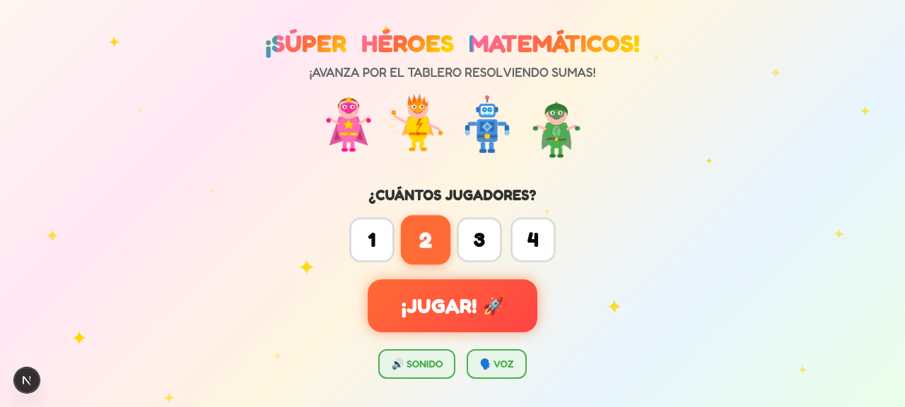
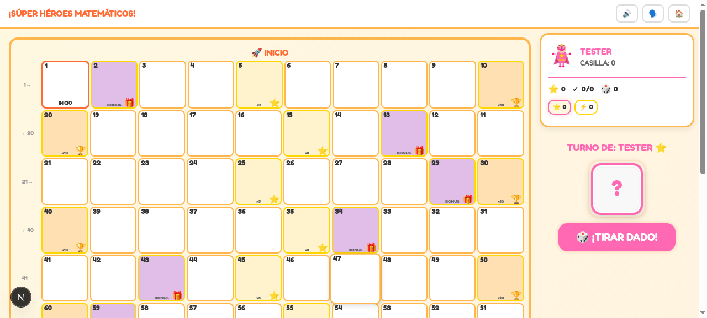
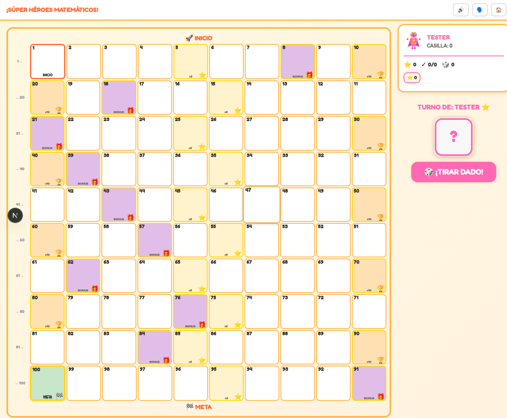

# 🎮 Superhéroes y Superheroínas Matemáticas

Un juego de mesa digital educativo por turnos, diseñado para enseñar matemáticas básicas a niños de 4 a 8 años a través de la aventura de superhéroes.

[](https://github.com/apmauj/super-juego/actions/workflows/deploy.yml)
[](https://apmauj.github.io/super-juego/)

## 📖 Descripción

Los niños practican **suma básica**, **reconocimiento numérico**, **conteo** y **lógica simple** mientras avanzan en un tablero temático de superhéroes. El juego combina aprendizaje con diversión colaborativa y competitiva amigable.

## 🎯 Objetivos Educativos

- **Matemática**: Suma, conteo, reconocimiento numérico, secuencias, múltiplos
- **Cognitivo**: Turnos, memoria, planificación simple
- **Lectura**: Reconocimiento de números y palabras

## 🎨 Características

- **8 Superhéroes únicos** con personalidades y colores distintivos
- **Tablero de 100 casillas** con diferentes tipos de recompensas
- **Multiplayer local** para 1-8 jugadores
- **Preguntas matemáticas** adaptadas al nivel
- **Animaciones y efectos visuales** atractivos para niños
- **Interfaz en MAYÚSCULAS** para facilitar la lectura
- **100% client-side** - funciona sin servidor

## 🦸‍♀️ Superhéroes Disponibles

| Personaje         | Color       | Emoji |
|-------------------|-------------|-------|
| CAPITANA ESTRELLA | Rosa        | ⭐    |
| RAYO VELOZ        | Amarillo    | ⚡    |
| MEGA BOT          | Azul        | 🤖    |
| ECO VERDE         | Verde       | 🌿    |
| FLAMA ÍGNEA       | Rojo        | 🔥    |
| CRISTAL POLAR     | Cian        | ❄️    |
| VELOCIBOT         | Morado      | ⚙️    |
| AQUA TORRENTE     | Azul agua   | 🌊    |

## 🎲 Cómo Jugar

1. **Elige cantidad de jugadores** (1-8)
2. **Selecciona tu superhéroe** favorito
3. **Ingresa tu nombre** (se convierte automáticamente a mayúsculas)
4. **Tira el dado** para determinar cuánto avanzas
5. **Resuelve la suma**: posición actual + resultado del dado
6. **Avanza en el tablero** y recibe recompensas
7. **¡Llega primero a la casilla 100 para ganar!**

### Tipos de Casillas

- **Normal**: Sin efecto especial
- **Recompensa x5**: Bonus de puntos
- **Recompensa x10**: Gran bonus
- **Bonus aleatorio**: Items coleccionables
- **Meta**: Fin del juego

## 🖼️ Screenshots

### Pantalla de Bienvenida


### Tablero de Juego


### Tablero Completo


## 🛠️ Tecnologías

- **Framework**: Next.js 15 con TypeScript
- **UI**: Tailwind CSS + ShadCN UI
- **Estado**: Zustand
- **Animaciones**: CSS + SVG
- **Deployment**: GitHub Pages (static export)
- **Compatibilidad**: Navegadores modernos, funciona offline

## 🚀 Instalación y Desarrollo Local

### Prerrequisitos

- Node.js 20+
- npm o bun

### Instalación

```bash
# Clona el repositorio
git clone https://github.com/apmauj/super-juego.git
cd super-juego

# Instala dependencias
npm install
# o
bun install

# Inicia el servidor de desarrollo
npm run dev
# o
bun run dev
```

El juego estará disponible en `http://localhost:3000`

### Build para Producción

```bash
# Build
npm run build

# Preview del build
npm run start
```

## 🌐 Deployment

El proyecto se despliega automáticamente a GitHub Pages cuando se hace push a la rama `main`.

### Manual Deployment

```bash
# Build para static export
npm run build

# Los archivos están en la carpeta `out/`
# Sube el contenido de `out/` a cualquier hosting estático
```

## 📁 Estructura del Proyecto

```
super-juego/
├── src/
│   ├── app/           # Next.js App Router
│   ├── components/    # Componentes React
│   │   ├── game/      # Componentes del juego
│   │   └── ui/        # Componentes UI reutilizables
│   └── lib/           # Utilidades y configuración
├── public/            # Assets estáticos
├── specs/             # Documentación del juego
└── .github/           # Workflows de CI/CD
```

## 🤝 Contribuir

¡Las contribuciones son bienvenidas! Este es un proyecto educativo open source.

1. Fork el proyecto
2. Crea una rama para tu feature (`git checkout -b feature/nueva-funcionalidad`)
3. Commit tus cambios (`git commit -m 'Agrega nueva funcionalidad'`)
4. Push a la rama (`git push origin feature/nueva-funcionalidad`)
5. Abre un Pull Request

### Ideas para Contribuir

- Más niveles de dificultad matemática
- Nuevos superhéroes
- Temas visuales adicionales
- Soporte para más idiomas
- Mejoras en accesibilidad

## 📄 Licencia

Este proyecto es open source y está disponible bajo la [Licencia MIT](LICENSE).

## 🙏 Agradecimientos

- Inspirado en juegos de mesa clásicos
- Diseñado pensando en la educación infantil
- Desarrollado con tecnologías web modernas

---

¡Diviértete aprendiendo matemáticas con superhéroes! 🦸‍♂️🦸‍♀️